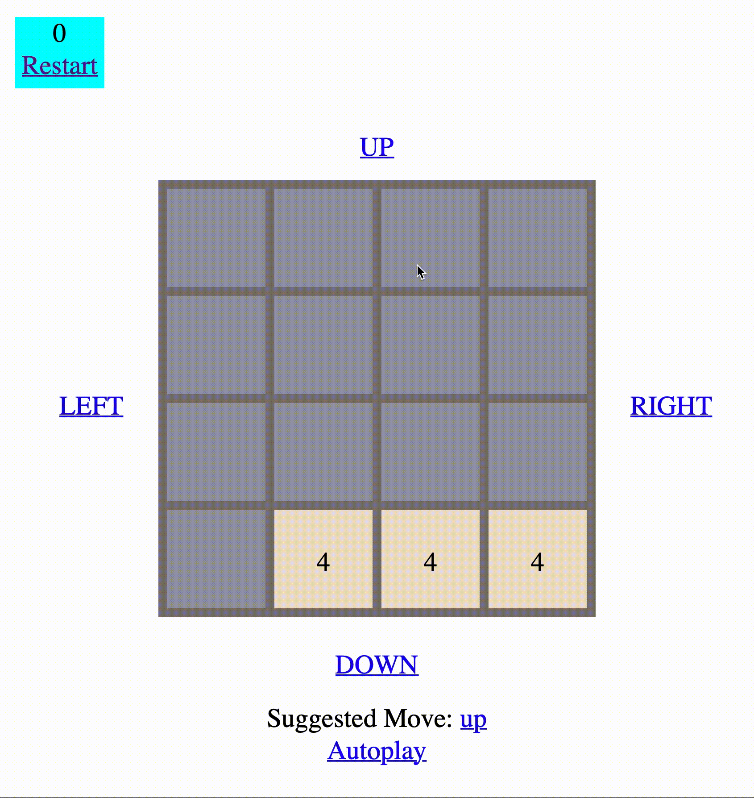
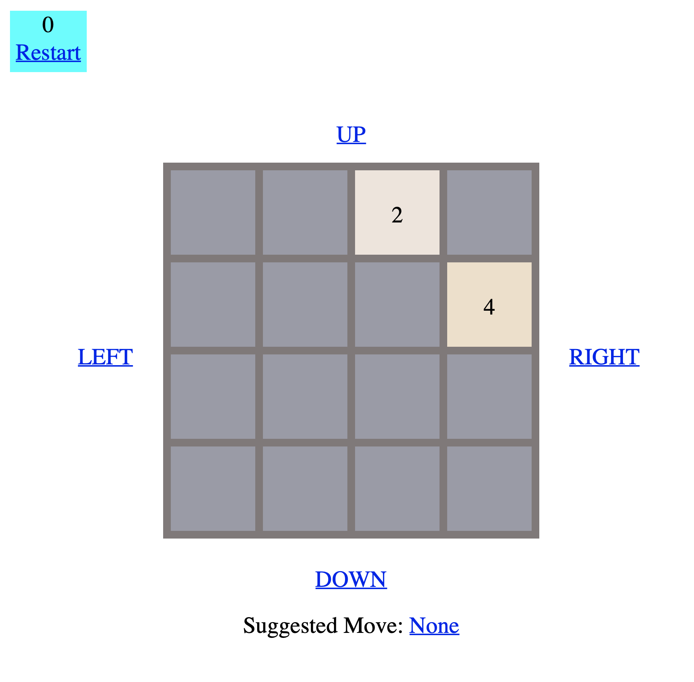
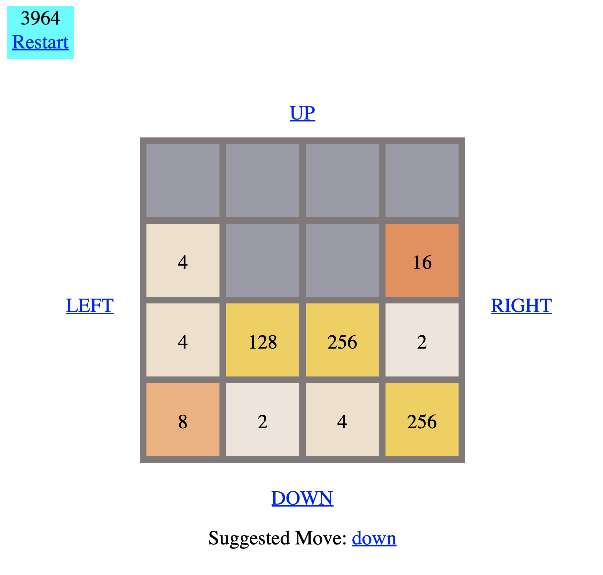

# flask-2048

by Walter Sebastian Gisler

One late afternoon I came accross the 2048 game by Gabriele Cirulli. (https://play2048.co) I am never playing games, but this one appealed to me. It has numbers in it. And those numbers are all powers of two, show me a mathematician who doesn't get excited by that. And it features a heatmap. Hard to beat that! It really got me hooked. Too hooked. So hooked, that I forgot about everything I had to do and played the game about a 100 times. I just couldn't stop. I needed a cure.

There is only one solution in such situations: take the fun out of it! One way of doing this, is to automate the process. Instead of playing the game myself, I let the computer play it. If I manage to get better scores using an algorithm, I'll get bored.

So, I sat down, and while it was already starting to get dark, I coded through the night and implemented the game myself and finally added an algorithm to it that suggests the next move by simulating the possible outcomes of all moves in the next couple of steps.

Why the hell would I use flask for this? Well, I am really into command line applications, but for this purpose I needed some kind of GUI. If there is one thing I dislike in programming, it is GUI design. Too tedious and not my strength. I have a good taste in wine, but not in GUI design. I rather leave that to other people. But I do know HTML and I am fast at putting together a halfway decent GUI using that. True, I could have used PHP or Rails and make this a full blown web application, but these days I am into Python. I've only used Flask for APIs so far, but it really isn't hard to build small apps with it. It is lightweight, it allows me to write my app as if it was a command line application and I am comfortable using it. A clear choice, in my opinion.

Alright, it isn't the nicest App and I was in a rush to write the code. But it is functional. I can play the game and the game can play itself!

I've included four strategies to play the game automatically. All of them work and get significantly better scores than if I play the game myself. Some of the moves are hard to understand as they might be preparing for a later move that at once gets rid of 5 or more tiles. Even though the strategies is looking at 9 moves in advance, it doesn't always manage to get to 2048, but many times it does. Interestingly, the strategy that the algorithm is choosing is not at all similar to what a human would intuitively do (i.e. trying to put the biggest number in a corner).

Enjoy and feel free to use the code.

## Running it

To run the game, you just need to have flask installed (pip install flask) and then you just run python run.py
After that, you can access the game in any webbrowser by typing http://localhost:5000/

## And here it is in action

